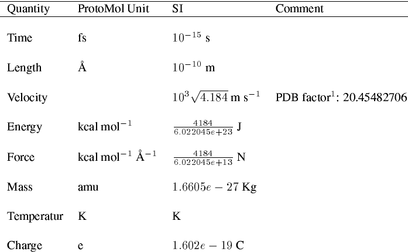

Unit system in ``ProtoMol``
===========================

Shown below, ``ProtoMol`` uses its own unit system (e.g. for position and velocity input), which is natural for bio-chemistry simulations. 

However, this becomes inconvenient for AMO simulations sometimes. A C++ class, ``ProtoMolAddon::SIAtomProxy`` has been introduced, as part of the addon package to faciliate conversion between SI unit and ``ProtoMol`` unit. To see how to use it, see XX section. 
